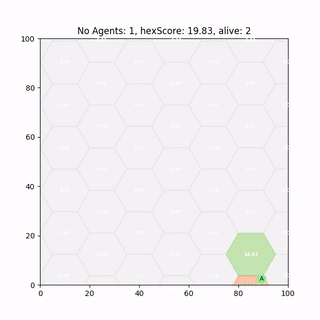
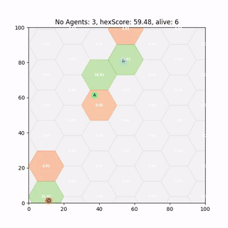

## Never work with angles
I'm sure if W.C. Fields was alive today and interested in machine learning he might have updated his maxim of never working with children or animals to include angles.

Many off the shelf RL algorithms seem like straightforward tools to replicate state of the art results on your own specific problem domain. Deep neural nets have shown great promise of 'learning' complex tasks such as computer vision and continuous control problems but to adapt them can be challenging and require greater knowledge of the underlying mathematics and Neural Network structures to debug problems - often parameter tuning by trial and error.

Lets have a look at Deep Deterministic Policy Gradient (DDPG) and see how well a Deep Neural Network, approximating a policy function, can perform at an angle based continuous control problem.

## Continuous Action Control choice for Persistent Surveillance
Some of my current work is looking at training/designing polices for multiple agents to perform persistent surveillance (similar to coverage/patrolling problems.). The aim is for agents to maximise some metric, 'hex score', that represents how well the world's current 'level of surveillance'.

As an agent enters a hex it observes it and the score shoots up, then all hexes currently not directly observed have their score decay (with some half life).



Our observation, and thus our input to our Neural Network are the hex scores around the agent. This is feed into our network in order to choose the optimal action (direction to move) for the agent to take.

### Single Neuron Output
The standard off the shelf DDPG algorithm for a continuous control task has a single neuron output.

 We replicate this and choose our output to be a single neuron, with a $\tanh$ activation function. This activation value which lies between $\[-1, 1\]$ can be multiplied by $\pi$ to recover an angle $\theta \in [-\pi, +\pi\]$ - this is the direction the agent should move.


### Trained DDPG Agent
After 2000 runs of 600 time steps the DDPG policy has successfully converged and produces *half decent* results.

It runs around *heating* those hexes up reaching decent scores, so lets see if we can improve it.

## Rose Plots and Neuron Saturation
While it appears to work fairly well, if we use a rose-plot to show action choices over an entire episode we can see an issue. This rose plot indicates frequency of angle chosen:

 - On the left we have completely random action selection;
 - In the middle a discrete 6 direction choice made by a simple greedy heuristic algorithm;
 - On the right a Deep Deterministic Policy Gradient (DDPG) as outline above.

What we hope for is something that produces a better, more continuous version of the heuristic (middle), instead what we get is good old **neuron saturation**. The problem here is the $\tanh$ activation function (and a problem that exists in all activation functions) saturates at +1 or -1, the asymptotes, and as a result so too does our action selection at $+\pi$ or $-\pi$ respectively.

### Double Neuron Output
That said, issues with working with angles and its discontinuities are well documented. One approach to fix this is to add more output neurons. We opt to add a second neuron and parametrise the action angle so that instead of multiplying the activation by $\pi$ we use it to represent $\sin(\theta)$ and $\cos(\theta)$ (which are easily converted into $\theta =\arctan(\sin(\theta)/\cos(\theta))$).




This balances out some of the neuron saturation but also seems to instead now saturate at the 'corners' [(1,1), (1,-1), (-1,-1), (-1,1)]

## Multi Agent Deployment
Some of our most recent work looks at whether we can simply train single agent policies like above and deploy them to multi agent problems - *without Multi-Agent RL*. It turns out we can, but there are catches. I recently gave a talk called [Ignorance is bliss - the role of noise and Heterogeneity in training and deployment of Single Agent Policies for the Multi-Agent Persistent Survellance Problem7](talk/collectivedynamics/) which goes into some more detail.

A paper which is currently under review, *Single-Agent Polices for the Multi-Agent Persistent Surveillance
Problem via Artificial Heterogeneity*, describes how deploying multiple heterogeneous agents can cause undesirable emergent clustering behaviour. So stay tuned for that. 
